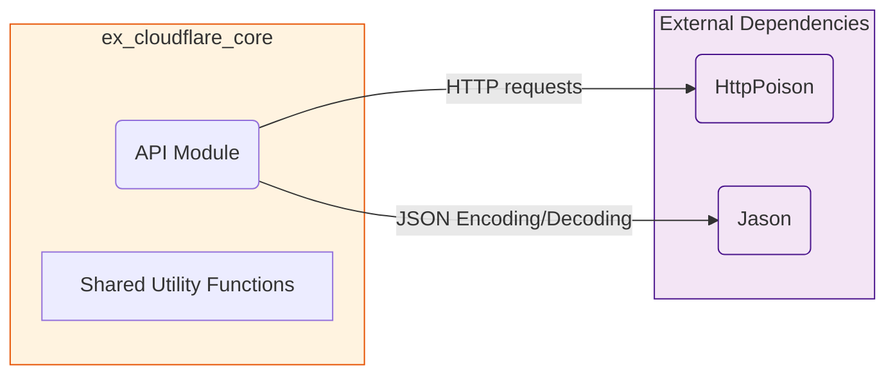

# ExCloudflareCore

**TODO: Add description**

## Installation

If [available in Hex](https://hex.pm/docs/publish), the package can be installed
by adding `ex_cloudflare_core` to your list of dependencies in `mix.exs`:

```elixir
def deps do
  [
    {:ex_cloudflare_core, "~> 0.1.0"}
  ]
end
```

Documentation can be generated with [ExDoc](https://github.com/elixir-lang/ex_doc)
and published on [HexDocs](https://hexdocs.pm). Once published, the docs can
be found at <https://hexdocs.pm/ex_cloudflare_core>.

**1. `ex_cloudflare_core` Architecture:**



**Discussion:**

This diagram depicts the core functionalities of `ex_cloudflare_core` in a simple and clear way. This package aims to be a lean set of shared tools and protocols.

At the center, we have the **`API` Module**, which serves as the single point of contact for all external API calls and is the only module to make direct usage of any of our external libraries. This is a fundamental design decision to abstract the intricacies of any HTTP library to a specific implementation and provides a single place where that logic is defined. This promotes ease of testing and refactoring.

The `API` module interacts with two well defined externals: `HTTP (HttpPoison)`: which will handle all of the actual HTTP requests, with methods such as `get`, `post`, `put`, `patch`, and `delete` being supported and `JSON (Jason)`: which will be used for all JSON handling (encoding and decoding) for HTTP request/response data.

Finally, the `Shared Utility Functions` is meant to contain all shared logic for any other layer that needs it, such as String formatting or specific parsing logic.

The key idea is that this module **does not have any high-level logic, nor business logic, nor any dependency on durable objects, or calls-specific types**. It only cares about making well formatted HTTP requests and returning Elixir-friendly data structures.

The `ex_cloudflare_core` package is **not an application**. Therefore it will not start a supervision tree, and will rely on the calling application to manage concurrent requests through other methods.
This design aims to create a minimal layer on top of HTTP requests.
